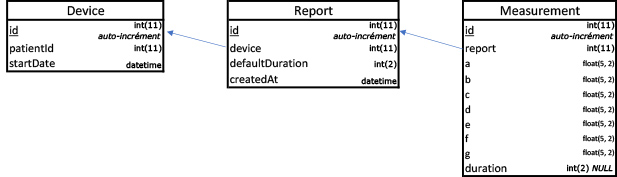

# sleepInnov : Stockage et affichage de données médicales

### 1 : Proposer une structure de BDD permettant de répondre à ce besoin fonctionnel

### 2 : Quel moteur de BDD pour y stocker les données ? Pourquoi ?
Je proposerai InnoDB (sous MySQL), PostgreSQL ou SQLite, car open source, largement documentés et éprouvés
### 3 : Requête SQL pour la page "Journée d'un appareil"
```sql
select r.id AS reportId, r.created_at,
    (select COUNT(id) from measurement where report_id = r.id) as nbreMesures,
    SUM(CASE WHEN m.duration IS NOT NULL 
       THEN m.duration
       ELSE r.default_duration END) AS totalDuration
from report r
left join measurement m on m.report_id = r.id
where r.device_id = 57
and r.created_at LIKE '2017-02-23%'
group by r.id;
```

**Notes :** *pour cette requête, je pars du principe que l'ID du DM est connu (#57 dans cet exemple), ainsi que la date (envoyés au controlleur via la requête HTTP, par exemple)*

**TODO :** *Par manque de temps, je ne ramène pas les moyennes des valeurs [a, ..., g] pondérées par la durée de chaque mesure.
Pour être tout à fait honnête, j'évite tant que possible d'effecteur ce genre de calculs directement en SQL et préfère généralement opérer côté applicatif, si l'impact en termes de ressources n'est pas trop important*

### 4 : Requête SQL pour la page "Journée d'un appareil"
```sql
select m.id as measurementId,
    m.a, m.b, m.c, m.d, m.e, m.f, m.g, 
    (CASE WHEN m.duration IS NOT NULL 
       THEN m.duration
       ELSE r.default_duration END) AS duration
from report r
left join measurement m on m.report_id = r.id
where r.id = 1
group by m.id
```

**Notes :** *Pour cette requête je pars du principe que l'ID du rapport est connu (#1 dans cet exemple). Ces paramètres peuvent être passés directement dans l'en-tête de la requête HTTP (GET ou POST)*

*On pourrait, bien entendu, filter sur le l'id du DM et la date/heure de création du rapport, en remplaçant "r.id = 1" par "where r.device_id = 57 and r.created_at = '2017-02-23 23:07:18'"*
